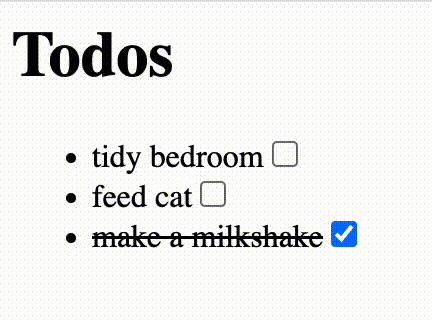

Example usage of TSX without npm or React.

# Install [swc](https://github.com/swc-project/swc)

Remember to pick the correct architecture. All releases listed [here](https://github.com/swc-project/swc/releases), for some reason many of the releases don't have a binary file, pick one like this:

```shell
curl -L -o ~/bin/swc https://github.com/swc-project/swc/releases/download/v1.5.6/swc-darwin-arm64
chmod +x ~/bin/swc
```

# Write a dumb-dumb's React

React is too complicated for our needs right now, let's just [blat everything on the page on each render](static/not-react.tsx).

# Write your application

See [static/index.tsx](static/index.tsx), [static/index.html](static/index.html).

# Compile your `.tsx` files

```shell
~/bin/swc compile --config-file=static/.swcrc --out-dir=. static/**/*.tsx
```

There are various useful options for eg. source maps if you'd like to set them up.

If you'd like to watch for changes (nicer ways are available):

```shell
fswatch -0 ./**/*.tsx | xargs -0 -n1 -I {} sh -c '~/bin/swc compile --config-file=static/.swcrc --out-dir=. $(echo {} | sed "s|$PWD/||")'
```

# Serve your app

```shell
python -m http.server
open -a "Google Chrome" localhost:8000/static
```
